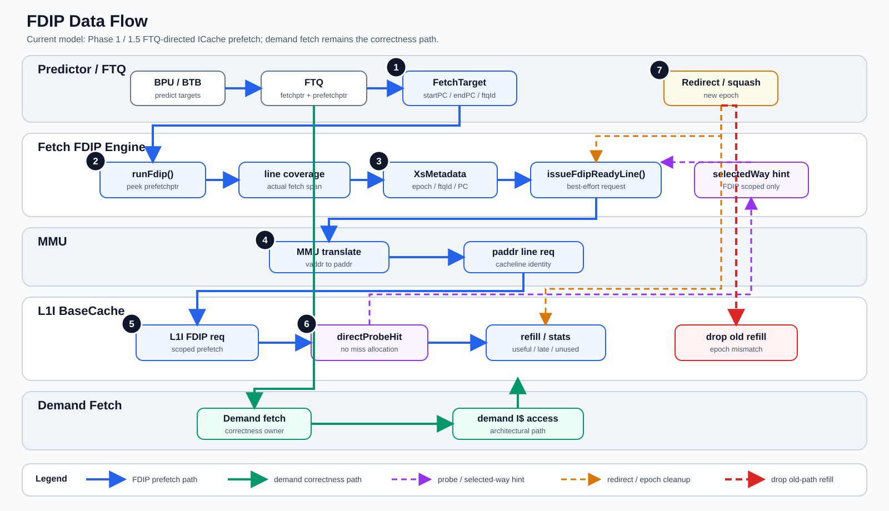
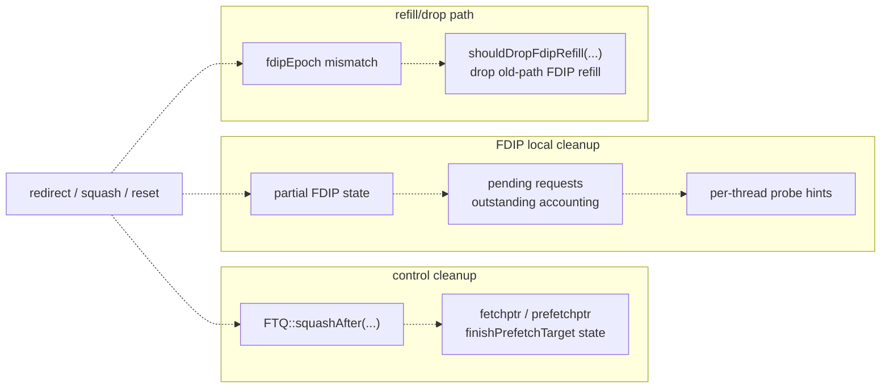

# FDIP Guidelines

> Executable contracts for the current FTQ-directed ICache prefetch model.
>
> **Source of truth as of 2026-06-24:** `trace-new` (HEAD `bb60673446`). The
> 7-commit `fdip-phase2-xsdev` port was fast-forwarded into `trace-new` main
> on 2026-06-24 after PRD `.trellis/tasks/06-15-fdip-port-onto-trace-new`
> acceptance criteria #1..#4 all PASS. The historical `fdip-phase2-xsdev`
> worktree still exists at `~/project/GEM5/.worktrees/fdip-phase2-xsdev`
> (HEAD `7868731908`) as a port-history reference; treat it as read-only.
> See `docs/Gem5_Docs/frontend/fdip.md` for the user-facing FDIP doc and
> `~/expri_results/gem5/btbp-fdip-smoke/20260624-1319/` for the acceptance
> evidence.

---

## Overview

Read this file before changing any of the following:

- `src/cpu/o3/fetch.cc`
- `src/cpu/o3/fetch.hh`
- `src/cpu/o3/fdip_cleanup.hh`
- `src/cpu/pred/btb/ftq.hh`
- `src/cpu/pred/btb/decoupled_bpred.hh`
- `src/cpu/pred/btb/decoupled_bpred.cc`
- `src/cpu/pred/BranchPredictor.py`
- `configs/common/Options.py`
- `configs/common/xiangshan.py`
- `configs/example/kmhv3.py`
- `src/mem/request.hh`
- `src/mem/cache/base.hh`
- `src/mem/cache/base.cc`
- `src/mem/cache/cache.cc`
- `src/mem/cache/cache_probe_arg.hh`
- `src/mem/cache/xs_l2/SlicedCacheAccessor.*`

This contract documents the **current implemented** FDIP model, not the full
paper-faithful or RTL-complete future design.

---

## Implementation Data Flow / 实现数据流



当前实现是 Phase 1 / 1.5 的 **FTQ-directed ICache prefetch**：它从
FTQ 的 runahead / prefetch target 读取预测窗口，尽力提前把对应 ICache
line 送入 memory/cache 路径。它不是完整 RTL 对齐或论文 faithful 的 future
design；FDIP 只影响 best-effort 性能路径，demand fetch 仍是 correctness
path。

上图是默认阅读入口：蓝色主线描述当前 FDIP best-effort prefetch path，
绿色主线保留 demand fetch 的 correctness path，紫色虚线是 direct probe /
selected-way hint，橙色虚线是 redirect / epoch cleanup，红色虚线表示 epoch
mismatch 后的 old-path FDIP refill drop。编号 1-7 对应下方关键步骤；图内只放
英文代码标识以降低 SVG 字体依赖，语义以本节文字为准。

<details>
<summary>Editable source / Mermaid fallback</summary>

### 主数据流

```mermaid
flowchart LR
  subgraph Control["control path: BPU / FTQ"]
    BPU["BPU / DecoupledBPUWithBTB"]
    FTQ["FTQ\nfetchptr + prefetchptr"]
    Target["FetchTarget\nstartPC / predEndPC / ftqId"]
    BPU --> FTQ --> Target
  end

  subgraph FetchLane["FDIP prefetch request path: Fetch"]
    Run["Fetch::runFdip(tid)\npeek prefetchptr"]
    Cover["computeFdipLineAddrs(...)\nactual fetch coverage"]
    Meta["Request::XsMetadata\nfdipEpoch / fdipFtqId / fdipStartPC"]
    Issue["startFdipTranslation\nfinishFdipTranslation\nissueFdipReadyLine"]
    Run --> Cover --> Meta --> Issue
  end

  subgraph MemoryLane["MMU + BaseCache path"]
    MMU["MMU translation"]
    Cache["BaseCache / L1I\nFDIP-scoped request"]
    Refill["FDIP refill / completion"]
    Stats["processFdipCompletion\nuseful / late / unused / drop stats"]
    MMU --> Cache --> Refill --> Stats
  end

  subgraph ProbeLane["direct probe / selected-way hint path"]
    Probe["direct probe hit\nno real miss allocation"]
    Hint["fdipSelectedWayValid\nfdipSelectedWay / tick"]
    Probe --> Hint
  end

  Target --> Run
  Issue --> MMU
  Cache -.-> Probe
  Hint -.-> Stats

  Demand["Demand fetch\ncorrectness path"] --> Cache
```



### Redirect / Epoch 清理图



</details>

### 关键步骤

- `BPU / FTQ` 产生 `FetchTarget`，`fetchptr` 驱动 demand fetch，
  `prefetchptr` 暴露给 FDIP runahead 使用。
- `Fetch::runFdip(tid)` 只查看 `prefetchptr` 对应的 future target，并受
  `fdip_issue_bandwidth`、`fdip_max_outstanding` 等 best-effort 约束限制。
- `computeFdipLineAddrs(...)` 按 demand fetch 相同的 actual fetch coverage
  计算 cacheline，边界 line 只有在真实 fetch 覆盖到时才纳入。
- `Request::XsMetadata` 携带 `fdipEpoch`、`fdipFtqId`、`fdipStartPC`，并在
  direct probe 命中时携带 `fdipSelectedWay*` hint。
- FDIP request 经过 `startFdipTranslation` / `finishFdipTranslation` 后进入
  MMU + `BaseCache`；cache 侧只把这些策略作用在 FDIP-scoped request 上。
- direct probe 可在命中时形成 selected-way hint 或完成 FDIP line，避免把
  旁路命中误建模成真实 miss allocation。
- redirect / squash 通过 epoch 与 per-thread cleanup 清理 partial state、
  pending request、outstanding accounting 和 probe hint；epoch mismatch 的旧路径
  FDIP refill 由 `shouldDropFdipRefill(...)` 丢弃。

### 读图约定 / Legend

- 蓝色实线：主 FDIP prefetch path，表示 FTQ-directed best-effort request 从
  `prefetchptr` 到 MMU / L1I / stats 的路径。
- 绿色实线：demand correctness path，表示 `fetchptr` 驱动的 architectural
  demand fetch；FDIP 不得改变该路径的正确性。
- 紫色虚线：direct probe / selected-way hint path，表示 FDIP-scoped bypass
  或 hint，不代表真实 miss allocation。
- 橙色虚线：redirect / epoch cleanup path，表示 squash/reset 后的 partial
  state、pending request、outstanding accounting 与 probe hint 清理。
- 红色虚线：old-path refill drop，表示 `fdipEpoch` mismatch 且 drop policy
  开启时，旧路径 FDIP refill 不安装进 L1I。
- 编号 1-7：对应“关键步骤”的维护契约边界；图中节点不是逐函数调用栈，新增实现
  应优先保持这些边界清晰。

---

## Scenario: Current FDIP Runtime Contract

### 1. Scope / Trigger

- Trigger: any change to FTQ-directed FDIP issue, predictor-side FDIP knobs,
  fetch-side FDIP state/lifecycle, request metadata, cache-side old-path refill
  drop, recent-unused suppression, or trace-mode FDIP observability.

### 2. Surfaces

Current parameter/config surface:

- `DecoupledBPUWithBTB.enable_fdip`
- `DecoupledBPUWithBTB.bpu_runahead_entries`
- `DecoupledBPUWithBTB.fdip_lookahead_entries`
- `DecoupledBPUWithBTB.fdip_issue_bandwidth`
- `DecoupledBPUWithBTB.fdip_max_outstanding`
- `DecoupledBPUWithBTB.prefetch_lines_per_ftq`
- `DecoupledBPUWithBTB.fdip_flush_partial_on_epoch_change`
- `DecoupledBPUWithBTB.fdip_drop_refill_on_epoch_mismatch`
- `DecoupledBPUWithBTB.fdip_recent_unused_cycles`

Current runtime/state surface:

- `Fetch::runFdip(ThreadID tid)`
- `Fetch::computeFdipLineAddrs(...)`
- `Fetch::resetFdipPartialState(ThreadID tid)`
- `Fetch::shouldDropFdipRefill(ContextID, const Request::XsMetadata &) const`
- `BaseCache::shouldSuppressFdipLine(Addr addr, bool is_secure, uint64_t cooldown_cycles) const`

Current request metadata surface:

- `Request::XsMetadata.fdipEpoch`
- `Request::XsMetadata.fdipFtqId`
- `Request::XsMetadata.fdipStartPC`
- `Request::XsMetadata.fdipSelectedWayValid`
- `Request::XsMetadata.fdipSelectedWay`
- `Request::XsMetadata.fdipSelectedWayTick`

### 3. Contracts

1. **FDIP-off invariance**
   - When `enable_fdip == false`, FDIP must not change architectural behavior.
   - `bpu_runahead_entries` must not throttle normal predictor behavior unless
     FDIP is enabled.

2. **Coverage contract**
   - FDIP cacheline coverage must follow the same actual fetch coverage used by
     demand fetch:
     - `startPC`
     - `predEndPC`
     - `fetchCoverageSpan(...)`
     - `fetchCoverageLastLineAddr(...)`
   - A cross-boundary 4B control-tail line must be included only when actual
     fetch coverage naturally reaches that line.

3. **Issue contract**
   - FDIP issue is best-effort only.
   - Demand fetch must remain functionally prior to FDIP.
   - Current tunable limits are:
     - `fdip_issue_bandwidth` (cachelines per cycle)
     - `fdip_max_outstanding` (cachelines)

4. **Redirect / partial-state cleanup contract**
   - Redirect/squash/reset must clear per-thread FDIP partial state:
     - thread-local state object
     - pending FDIP requests for that thread
     - outstanding-line accounting for removed in-flight requests
     - probe hints for that thread
   - The helper-level contract is implemented in:
     - `src/cpu/o3/fdip_cleanup.hh`

5. **Old-path refill contract**
   - When `fdip_drop_refill_on_epoch_mismatch == true`, old-path FDIP refills
     must not install into L1I on epoch mismatch.
   - This policy must stay scoped to FDIP traffic only.

6. **Recent-unused suppression contract**
   - Suppression must key on physical cacheline identity plus security domain:
     - `(blkAddr, isSecure)`
   - It must never suppress demand fetch.

7. **Probe / selected-way contract**
   - Direct probe hit may complete an FDIP line without allocating a real miss.
   - The resulting selected-way hint is current-model behavior and must remain
     explicitly FDIP-scoped.

### 4. Validation & Error Matrix

| Condition | Expected Behavior | Enforcement / Symptom |
|-----------|-------------------|------------------------|
| `enable_fdip == false` | FDIP path inactive; no FDIP requests issued | smoke / behavior parity |
| `prefetch_lines_per_ftq == cover_actual_fetch_range` and target spans cross-boundary control-tail | second cacheline is included | `fetch_coverage.test` witness |
| redirect/squash happens with pending FDIP partial state | partial state cleared, old hints removed | `fdip_cleanup.test` witness |
| epoch-mismatched FDIP refill with drop policy enabled | refill not installed into ICache | `fdipDroppedRefill` rises |
| recently-unused FDIP line revisited within cooldown window | FDIP line suppressed, demand unaffected | `fdipFilteredRecentUnused` rises |
| trace-mode high-I$ sanity run with FDIP enabled | `fetch.icacheStallCycles` changes and timeliness stats are non-trivial | `crypto14` / `compute_int_32` |

### 5. Good / Base / Bad Cases

- Good:
  - `crypto14` and `compute_int_32` show non-trivial:
    - `fetch.icacheStallCycles`
    - `fdipUsefulHits`
    - `fdipLate`
    - `fdipUnused`
- Base:
  - `srv67` smoke / 5M with tuned-on config stays performance-neutral to
    slightly positive while reducing repeated bad lines.
- Bad:
  - reintroducing `stallReason[0]`-based stall accounting
  - keying recent-unused tracking by raw `Addr` only
  - treating helper-level cleanup witness as a full mid-flight redirect harness

### 6. Tests Required

For current-model edits, the narrow required validation set is:

- `openspec validate add-fdip-icache-prefetch --strict`
- `scons build/RISCV/gem5.opt -j<N>`
- `scons build/RISCV/cpu/pred/btb/test/fetch_coverage.test.opt --unit-test -j<N>`
- `build/RISCV/cpu/pred/btb/test/fetch_coverage.test.opt`
- `scons build/RISCV/cpu/o3/fdip_cleanup.test.opt --unit-test -j<N>`
- `build/RISCV/cpu/o3/fdip_cleanup.test.opt`

For tuned-on sanity / regression:

- one focused `srv67` smoke
- one focused `srv67` 5M run
- two high-I$ sanity traces:
  - `crypto14`
  - `compute_int_32`

### 7. Current Limitations

- This is still a Phase 1 / 1.5 model, not full RTL alignment.
- No full tag/data split ICache interface exists yet.
- `prefetchPtr` / FTQ peek plumbing is not yet paper/RTL complete.
- `system.cpu.iew.fetchStallReason::IcacheStall` still remains zero in current
  trace-mode runs even though `system.cpu.fetch.icacheStallCycles` now moves.
- Redirect cleanup proof is helper-level, not a full fetch-stage directed
  harness.

### 8. Decision Guidance

Current recommendation:

- treat the current stack as complete for the P0/P1 stabilization cut
- stop at Phase 1 / 1.5 unless a new research question specifically requires
  deeper RTL-fidelity work

---

## SMT-FTQ ↔ FDIP Coexistence Contract (2026-06-24)

Background. `trace-new` shipped an SMT-aware FTQ
(`ftqMode`, `SMTFTQPolicy`, `smtFTQThreshold` — see
`src/cpu/pred/btb/decoupled_bpred.{cc,hh}`) before FDIP was ported in.
`fdip-phase2-xsdev`'s FDIP path was originally authored single-thread.
The port reconciled the two; the executable contract below documents the
resulting shape so future edits do not regress it.

### Files

- `src/cpu/o3/fetch.{cc,hh}` — all FDIP state is **per-thread**.
- `src/cpu/pred/btb/decoupled_bpred.{cc,hh}` — FTQ accessors are
  thread-aware; FDIP prefetch-head accessors take `ThreadID tid`.
- `configs/example/kmhv3.py` — `args.enable_fdip` branch wires
  per-CPU FDIP plumbing.

### Required invariants

| # | Invariant | Where enforced | Failure symptom |
|---|---|---|---|
| S1 | `Fetch::runFdip()` is the thread-iterating outer loop; per-thread issue is `Fetch::runFdip(tid)`. | `src/cpu/o3/fetch.cc` | One thread's `prefetchptr` drives another thread's FDIP issue → wrong-path counters explode on SMT runs. |
| S2 | Every FDIP issue/cleanup site keys on `tid`: candidate ring, recent-unused suppression cache, partial-state cleanup. | `src/cpu/o3/fetch.{cc,hh}`, `src/cpu/o3/fdip_cleanup.hh` | `fdip_cleanup.test` regresses; or cross-thread squash leaks partial state. |
| S3 | The SMT FTQ constructor guard `panic_if(ftqMode==Shared && ftqPolicy==Threshold && smtFTQThreshold > ftqEntries, ...)` and the FDIP MVP guard `fatal_if(enableFDIP && !fdipFlushPartialOnEpochChangeCfg, ...)` both stay present and **independent** (no order coupling). | `src/cpu/pred/btb/decoupled_bpred.cc` ctor body | Misconfigured SMT-FTQ or `--no-fdip-flush-partial-on-epoch-change` slips past startup. |
| S4 | `resetPC` keeps the trace-new SMT loop over `tid`; it does not collapse to a single-thread fast path even when only `tid=0` is active. | `src/cpu/o3/fetch.cc::resetPC` | Single-thread runs OK, SMT runs hit stale PC on the second context. |
| S5 | Trace-mode hooks (`src/cpu/o3/trace/{TraceFetch.{cc,hh},TraceReader.*,ChampSimTraceReader.*,CBP2025TraceReader.*}`) are not modified to "accommodate" FDIP. FDIP adapts to trace-mode, not the other way round. | `src/cpu/o3/trace/*` | Any diff there must be justified independently of FDIP. |

### Validation

- AC #1 evidence: every commit in the 7-commit FDIP stack
  (`30f9fc3d24..bb60673446`) builds independently.
  See `~/expri_results/gem5/btbp-fdip-smoke/20260624-1319/per-commit-build/PER_COMMIT_BUILD_REPORT.md`.
- AC #2 evidence: FDIP-off vs pre-FDIP `trace-new` is bit-equivalent on
  hard-perf columns (libquantum SimPoint 67297). Only diff is +1
  cosmetic cycle on `fetch.squashCycles`. See
  `~/expri_results/gem5/btbp-fdip-smoke/20260624-1319/REPORT.md`.

---

## FDIP under trace-mode (coexist-and-active)

Status (2026-06-24): FDIP and `--enable-trace-mode` **coexist and remain
active**, not coexist-but-inert as an earlier draft had suggested.

### What actually happens under trace-mode + FDIP-on

- The decoupled BPU still runs (predictor consumes the committed-trace
  instructions injected by `TraceFetch`); FTQ entries are still produced.
- FDIP candidate generation reads those FTQ entries and issues real L1I
  prefetches.
- L1I records the FDIP traffic: `system.cpu.icache.fdipInstalled`,
  `fdipUsefulHits`, `fdipLate`, `fdipUnused`, `fdipProbeHit`, … all move.

### Measured shape (ChampSim `ipc_client_001`, 1 M committed insts)

| Stat | trace-on + FDIP-off | trace-on + FDIP-on |
|---|---:|---:|
| `system.cpu.fetch.fdip*` non-zero counters | 0 | 14 |
| `system.cpu.icache.fdip*` non-zero counters | 0 | 21 |
| `system.cpu.icache.fdipInstalled` | 0 | 888 |
| `system.cpu.icache.fdipUsefulHits` | 0 | 118 |
| `system.cpu.fetch.fdipIssuedLines` | 0 | 13 236 |
| `system.cpu.fetch.fdipWrongPathIssuedLines` | 0 | 8 973 |
| `system.cpu.numCycles` | 420 973 | 420 093 (−0.21 %) |
| `system.cpu.ipc` | 2.375454 | 2.380435 (+0.21 %) |

Source: `~/expri_results/gem5/btbp-fdip-smoke/20260624-1319/trace-mode/TRACE_MODE_REPORT.md`.

### Implication for spec edits

- Do **not** add a Python-layer `assert not (args.enable_fdip and
  args.enable_trace_mode)` mutex. The PRD §Technical Notes ("降级方案")
  is reserved for a *coexist-but-crash* future regression, not the
  current shape.
- Do **not** trust `system.cpu.dcache.fdip*` as a coexistence signal —
  D-cache is unrelated to FDIP (which is an I-cache prefetcher); those
  counters are zero in every FDIP configuration and are not a witness
  of anything.
- If a future change makes trace-mode + FDIP regress, the witness must
  be a non-zero delta on `fetch.fdip*` / `icache.fdip*` between
  trace-on-FDIP-off and trace-on-FDIP-on, not just `--enable-fdip`
  flag-accept.

---

## Worktree quirk: ext/dramsim3/DRAMsim3 (2026-06-24)

`ext/dramsim3/DRAMsim3/` is **not** a git submodule. It is `.gitignored`
local source (see `.gitignore:46`, `ext/dramsim3/README`); only
`ext/dramsim3/{README,SConscript,xiangshan_configs/}` are tracked. A
fresh worktree created via `git worktree add` will therefore have an
empty `ext/dramsim3/DRAMsim3/`, and `scons` will silently skip
`dramsim3.{cc,o}` / `param_DRAMsim3.cc` / `mem/dramsim3.cc`. The
resulting `gem5.opt` then fails to instantiate `DRAMsim3` at runtime
("Invalid mem_type: 'DRAMsim3'", `KeyError`).

### Required prep for any new worktree that needs DRAMsim3

Pick one. Symlink is preferred (no disk duplication, guaranteed
byte-identical with the main tree).

```bash
# Option A (preferred): symlink to the main tree's source
ln -s ~/project/GEM5/ext/dramsim3/DRAMsim3 \
      ~/project/GEM5/.worktrees/<name>/ext/dramsim3/DRAMsim3

# Option B: independent copy (≈20 MiB extra disk; drift risk)
cp -r ~/project/GEM5/ext/dramsim3/DRAMsim3 \
      ~/project/GEM5/.worktrees/<name>/ext/dramsim3/DRAMsim3
```

Then `scons build/RISCV/gem5.opt -jN` — expect only `dramsim3.{cc,o}`
+ `param_DRAMsim3.cc.o` + `mem/dramsim3.cc.o` + `base/date.cc.o` + link
(~3 min). If the rebuild touches >50 source files, the build cache is
trashed, not this quirk; investigate independently.

### Why a script could do this automatically (future work)

A `util/setup_worktree_dramsim3.sh` that idempotently creates the
symlink would let any `git worktree add` flow stay one command. Tracked
out-of-scope here.

---

## Legacy KMH FDIP vs Phase2 FDIP (50 traces, 2026-05)

This section captures the comparison study from trellis task
`05-09-fdip-kmh-legacy-port-compare`. Use it as the default reference
when deciding whether to keep legacy KMH FDIP as a baseline, retire it,
or use it to explain current FDIP deltas.

### Setup

- Workload: first 50 rows of
  `/nfs/home/share/glr/champsim_traces/champsim_traces_btb_and_icache_intensive.lst`.
- Branches:
  - legacy KMH FDIP port: branch `fdip-kmh-legacy-port-compare`, started
    from baseline commit `103c503233`, with the legacy
    `origin/kmh-fdip` FDIP (core commits `aa1a36a395`, `5f2344a383`,
    `2c05e4373c`) ported back and adapted only at interface boundaries.
  - current FDIP: branch `fdip-phase2-xsdev` (FTQ-directed phase2).
- Both variants used the same trace root, scheduler, and resource
  settings; legacy FDIP is enabled via
  `util/xs_scripts/trace/run_trace_champsim_legacy_fdip_on.sh`, which
  injects `--l1i-hwp-type=FDIPPrefetcher`.
- Aggregator: `util/xs_scripts/trace/compare_fdip_top50.py`.

### Headline result

- Completion: 50/50 on both sides, 0 aborts.
- Mean IPC, old: **2.187714**.
- Mean IPC, new: **2.182969**.
- Old IPC > new IPC: **30** workloads.
- New IPC > old IPC: **20** workloads.
- Per-workload data: `.regression_runs/fdip_kmh_legacy_compare/compare_fdip_top50.csv`.

### Workload breakdown

- `srv*` workloads (49 of 50): old wins 29, new wins 20; both leads are
  small in magnitude (mean lead ~0.006 IPC either way). The two sides
  are effectively tied across the srv class.
- `compute_int_32` (1 of 50): old IPC 2.286 vs new IPC 2.090, old leads
  by ~0.20 IPC. This is the single largest gap in the run and is the
  main reason the aggregate mean tilts toward old.

### Known confounders

- The legacy worktree could not complete the 50-trace batch cleanly
  without first synchronizing trace-mode plumbing changes
  (`src/cpu/o3/trace/*`, `src/cpu/o3/fetch.*`, decoupled BPU squash
  alignment) from the current tree. The old-vs-new gap therefore is not
  a pure FDIP-algorithm comparison; trace-infrastructure parity is a
  prerequisite, not a result.
- Legacy and current trees do not expose identical FDIP stat names.
  `old_icacheStallCycles`, `old_trySendPrefetch`, and
  `old_demandSendPrefetch` are blank in the legacy CSV columns; the
  current tree reports `system.cpu.fetch.icacheStallCycles`. Aggregate
  comparisons against ICache-stall or FDIP-internal counters must
  preserve this asymmetry per the Trace Batch Comparison Reports
  contract in `trace-debug-tooling.md`.

### Takeaways

- Within ICache-intensive ChampSim traces, the FTQ-directed phase2 FDIP
  is performance-neutral relative to the legacy KMH L1I FDIP at the IPC
  aggregate (delta ~0.22% in favor of legacy). The current FDIP does
  not regress the legacy baseline outside one outlier workload.
- Keep legacy KMH FDIP as a *baseline reference for explaining current
  FDIP deltas*, not as a production replacement: it is older, narrower
  in scope, and only ran here after consuming current-tree trace-mode
  fixes.
- The `compute_int_32` outlier is the most useful single signal: it is
  the workload where the legacy algorithm noticeably outperforms phase2
  FDIP, so it is the natural target if a research question asks "where
  did phase2 FDIP regress against legacy KMH FDIP?".
- **Next-study prerequisite:** any future legacy-vs-phase2 algorithm
  comparison must first isolate trace-infrastructure parity. The IPC
  delta observed here cannot be attributed purely to FDIP differences
  until both branches share an identical trace/fetch/BPU infrastructure
  baseline. Use this row only as a calibration anchor, not as evidence
  of FDIP algorithm regression.
